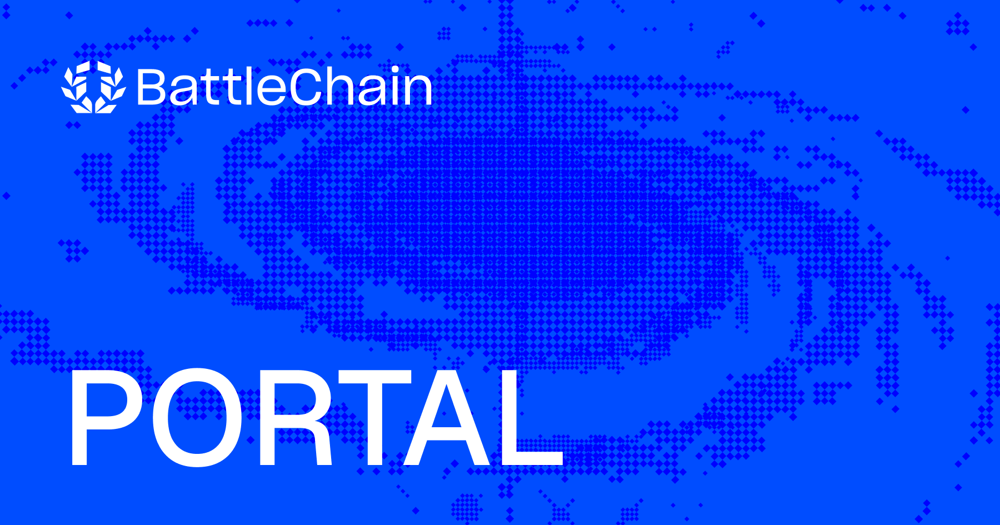

# BattleChain Portal

A bridge, token manager, and transaction history UI for the BattleChain network.

> Forked from [matter-labs/dapp-portal](https://github.com/matter-labs/dapp-portal) and adapted for BattleChain by [Cyfrin](https://www.cyfrin.io).

Production deployment: [portal.battlechain.com](https://portal.battlechain.com/).

## Features

- Bridge assets between L1 and BattleChain.
- Send, receive, and manage tokens.
- Maintain a contact book for frequently-used addresses.
- Connect to a local ZKsync node or a custom ZK Stack Hyperchain for development.

## Connecting to a local node

**Prerequisites:** Node.js 20+ and npm 10.9.7 (pinned via `packageManager` in `package.json`).

1. Set up a local ZKsync node — either in-memory or dockerized — by following the [ZKsync local-setup documentation](https://docs.zksync.io/zksync-network/tooling/local-setup).
2. Clone and install:
   ```bash
   git clone https://github.com/Cyfrin/bc-dapp-portal.git
   cd bc-dapp-portal
   npm install
   ```
3. If your network ID, RPC URL, or token list differs from the defaults, edit `data/networks.ts`. The [hyperchain configuration form](./hyperchains/README.md#configure-automatically-with-form) is an alternative for guided setup.
4. Start the dev server against your local node:
   ```bash
   # in-memory node
   npm run dev:node:memory

   # dockerized setup
   npm run dev:node:docker
   ```
   The Portal serves on http://localhost:3000 by default.

## Connecting to a Hyperchain

See [hyperchains/README.md](./hyperchains/README.md) for ZK Stack Hyperchain setup.

## Development

### Configuration

The committed `.env` contains working defaults for local development. Override these for production deployments.

**L1 balances.** By default, L1 balances are fetched via a public RPC. For higher throughput, use a provider like [Ankr](https://www.ankr.com/rpc/) and set:

```bash
ANKR_TOKEN=your_ankr_token_here
```

**WalletConnect.** Create your own project on the [Reown Cloud dashboard](https://dashboard.reown.com) and set its ID:

```bash
WALLET_CONNECT_PROJECT_ID=your_project_id_here
```

**Sentry.** For error reporting, set:

```bash
SENTRY_DSN=your_sentry_dsn
SENTRY_ENV=localhost  # localhost | production
```

`SENTRY_ENV` is used to filter issues by environment.

### Run

```bash
npm install
npm run dev      # serves on http://localhost:3000
```

### Registering well-known tokens

The bridge UI shows a curated list of ERC20 tokens defined in `data/wellKnownTokens.ts`. These must be registered in the L1 `NativeTokenVault` before users can bridge them. After updating the list, run:

```bash
PRIVATE_KEY=<deployer_private_key> BRIDGEHUB=<bridgehub_address> npx ts-node scripts/registerWellKnownTokens.ts
```

Environment variables:

- `PRIVATE_KEY` — deployer key with enough Sepolia ETH for gas
- `BRIDGEHUB` — Bridgehub contract address (Sepolia: `0xcEa5C0ade89389Dd5FC461F69CCbD812cFb7fbd8`)
- `RPC_URL` — L1 RPC endpoint (default: public Sepolia RPC)
- `L1_CHAIN_ID` — defaults to `11155111` (Sepolia)

The script skips already-registered tokens, so it's safe to re-run.

### Production build

```bash
npm run generate
```

See the [Nuxt 3 documentation](https://nuxt.com/docs/getting-started/introduction) for build details.

## Contributing

PRs welcome — open one [here](https://github.com/Cyfrin/bc-dapp-portal/pulls).

## License

[MIT](./LICENSE).
